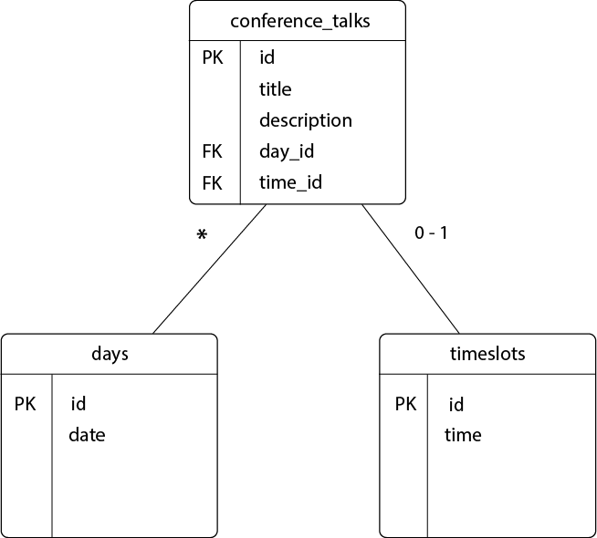

# PGR200 Hovedinnlevering

Rebecca Urquhart(urqreb17) og Tharin Chobkaphol (chotha17)


## Hvordan kjøre programmet

Stå i parent modulen og kjør kommandoen "mvn test" i terminalen for å sjekke testene og "mvn package" for å lage jar filer.
Kjør main metoden i EchoServer for å opprette forbindelse til server. Kjør deretter main metoden i HttpRequest for å sjekke at det er kobling.

Etter dette kan serveren godt stoppes. De resterende kommandoene vil kun bli kjørt lokalt over terminalen.

Fortsett å stå i parent modulen for å kjøre java -jar kommandoene. Se lengst nede i eksempel kjøring for java -jar kommandoer.

Liste over argumenter til jar kommandoer:
1. insert  - oppretter tabeller i databasen
2. add  - legger til en ny rad i tabellen
3. update -updatetitle  - oppdaterer tittel i en rad
4. show -topic  - viser talks med det spesifikt topic. (tilgjengelige topics: java, HTML & CSS, kotlin)
5. list -talks -topics   - lister opp talks etter navn og topic
6. resetdb  - sletter alle tabellene i databasen


#### Eksempel kjøring

```bash
> mvn test
[INFO] Scanning for projects...
[INFO] ------------------------------------------------------------------------
[INFO] Reactor Build Order:
[INFO] 
[INFO] PGR200 Mappeinnlevering                                            [pom]
[INFO] database                                                           [jar]
[INFO] http                                                               [jar]
[INFO] commandline                                                        [jar]
[INFO] 
[INFO] ----------< no.kristiania.pgr200:pgr200-innlevering-starter >-----------
[INFO] Building PGR200 Mappeinnlevering 0.0.1-SNAPSHOT                    [1/4]
[INFO] --------------------------------[ pom ]---------------------------------
[INFO] 
[INFO] --- jacoco-maven-plugin:0.8.2:prepare-agent (default) @ pgr200-innlevering-starter ---
[INFO] argLine set to -javaagent:/Users/rebeccaurquhart/.m2/repository/org/jacoco/org.jacoco.agent/0.8.2/org.jacoco.agent-0.8.2-runtime.jar=destfile=/Users/rebeccaurquhart/Desktop/pgr200-eksamen-beccarella/target/jacoco.exec
....
-------------------------------------------------------
 T E S T S
-------------------------------------------------------
....

> mvn package eller evt. mvn install
[INFO] Scanning for projects...
[INFO] ------------------------------------------------------------------------
[INFO] Building conference-server 0.1-SNAPSHOT
[INFO] ------------------------------------------------------------------------
[INFO]
...
[INFO] --- maven-jar-plugin:2.4:jar (default-jar) @ conference-server ---
[INFO] Building jar: e:\Profiles\jbrodwal\workspaces\demo\conference-server\target/conference-server-0.1-SNAPSHOT.jar
[INFO]
[INFO] --- maven-shade-plugin:3.1.1:shade (default) @ conference-server ---
[INFO] Including org.postgresql:postgresql:jar:42.2.2 in the shaded jar.
[INFO] Replacing original artifact with shaded artifact.
[INFO] ------------------------------------------------------------------------
[INFO] BUILD SUCCESS
[INFO] ------------------------------------------------------------------------
[INFO] Total time: 12.565 s
[INFO] Finished at: 2018-07-08T17:18:12+02:00
[INFO] Final Memory: 21M/211M
[INFO] ------------------------------------------------------------------------


Fortsett å stå i parent module 
> java -jar database/target/database-0.0.1-SNAPSHOT.jar insert 
> java -jar database/target/database-0.0.1-SNAPSHOT.jar add
> java -jar database/target/database-0.0.1-SNAPSHOT.jar update -updatetitle
> java -jar database/target/database-0.0.1-SNAPSHOT.jar show -topic
> java -jar database/target/database-0.0.1-SNAPSHOT.jar list -talks -topics
> java -jar database/target/database-0.0.1-SNAPSHOT.jar resetdb


evt, dersom man står i database modulen

> cd database
> java -jar target/database-0.0.1-SNAPSHOT.jar insert 
> java -jar target/database-0.0.1-SNAPSHOT.jar add
> java -jar target/database-0.0.1-SNAPSHOT.jar update -updatetitle
> java -jar target/database-0.0.1-SNAPSHOT.jar show -topic
> java -jar target/database-0.0.1-SNAPSHOT.jar list -talks -topics
> java -jar target/database-0.0.1-SNAPSHOT.jar resetdb
```


## Vurdering av eget arbeid

Dette har vært et adskillig tøffere prosjekt å jobbe med enn arbeidskravene. Stressnivået har vært skyhøyt, vi har blitt pushet til randen og har ikke alltid hatt den beste tonen oss i mellom. Men vi har kjempet igjennom det og partnerskapet er fortsatt inntakt. Vi har blitt kjent med hverandre på godt og vondt, og har lært mye mer om det å jobbe i et partnerskap på dette prosjektet enn vi har gjort på tidligere prosjekter. 

Overlappende eksamen for det ene team medlemmet fikk noen uheldige konsekvenser, og vi gikk rett og slett tom for tid og ressurser til å kunne implentere kode som kunne sende og motta data over socket. Hadde vi rukket dette er vi sikre på at vi kunne klart å oppnå en B karakter.
Planen vår var også å lage en langt større database og joine flere av tabellene sammen, men vi endte til slutt opp med å lage en liten og enkel database, slik at vi kunne fokusere på funksjonalitet fremfor en grandios database arkitektur som ikke hadde fungert like bra.
I prosjektet ligger det også en modul ved navn commandline. Denne blir dessverre ikke tatt i bruk av programmet, grunnet tidspress, men vi har valgt å ikke fjerne den, for å vise til planene vi jobbet mot, og fordi vi syns koden med tilhørende tester er god (dog uferdig).

Vi har slitt veldig med å få til koblingen mellom server og database. Her har vi endelig sett lyset (og det viste seg å egentlig være ganske enkelt). "innlevering.properties" filen har også gitt oss helt enormt mye hodebry. Dette har vært en gjenganger hos alle gruppene virker det som, og både vi og veileder har brukt unødvendig mye tid på å få dette til. Tid som ellers kunne blitt brukt til å skrive faktisk kode.

Vi har til slutt klart å komme frem til en kjørbar løsning, som kanskje ikke er like god som vi skulle ønske, men som vi begge har lagt absolutt alt vi har i. Hadde vi blitt vurdert ut i fra hvor mye innsats vi har lagt i arbeidet, så hadde vi definitivt fått en A++. Rent faglig sett derimot, så mener vi at vi har gjort nok til å få bestått (vi ønsker oss selvfølgelig en C og mener vi har gjort nok til å fortjene det, men er redd vi kan ende opp med en D).


### Datamodell



## Link til video

https://www.youtube.com/watch?v=laElnEZqslE

